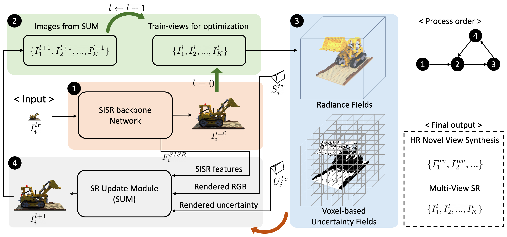

## [CVPR 2023] Cross-Guided Optimization of Radiance Fields With Multi-View Image Super-Resolution for High-Resolution Novel View Synthesis <br><sub>Official PyTorch Implementation </sub>

[Paper](https://arxiv.org/abs/2410.00672)

## Introduction

Novel View Synthesis (NVS) aims at synthesizing an image from an arbitrary viewpoint using multi-view images and camera poses. Among the methods for NVS, Neural Radiance Fields (NeRF) is capable of NVS for an arbitrary resolution as it learns a continuous volumetric representation. However, radiance fields rely heavily on the spectral characteristics of coordinate-based networks. Thus, there is a limit to improving the performance of high-resolution novel view synthesis (HRNVS). To solve this problem, we propose a novel framework using cross-guided optimization of the single-image super-resolution (SISR) and radiance fields. We perform multi-view image super-resolution (MVSR) on train-view images during the radiance fields optimization process. It derives the updated SR result by fusing the feature map obtained from SISR and voxel-based uncertainty fields generated by integrated errors of train-view images. By repeating the updates during radiance fields optimization, train-view images for radiance fields optimization have multi-view consistency and high-frequency details simultaneously, ultimately improving the performance of HRNVS. Experiments of HRNVS and MVSR on various benchmark datasets show that the proposed method significantly surpasses existing methods.

### Framework


# Citation

If you find this project helpful in your research, welcome to cite the paper.

```
@inproceedings{yoon2023cross,
  title={Cross-guided optimization of radiance fields with multi-view image super-resolution for high-resolution novel view synthesis},
  author={Yoon, Youngho and Yoon, Kuk-Jin},
  booktitle={Proceedings of the IEEE/CVF Conference on Computer Vision and Pattern Recognition},
  pages={12428--12438},
  year={2023}
}
```

# Contact

Please contact Youngho Yoon if there is any question (dudgh1732@kaist.ac.kr).
